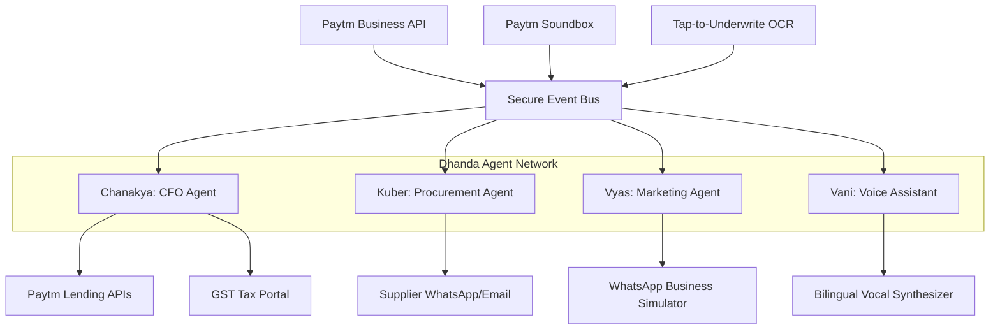

# Dhanda.ai (Paytm Merchant Copilot)

> **Autonomous Multi-Agent Business Operating System for India's 30M+ Kirana Stores.**  
> Submitted under **Track 3: Paytm Challenge - AI-Powered Fintech Innovation** at **Agent{A}thon 2026**.

---

## 🌟 Introduction & Impact

Local retail merchants (Kiranas) form the backbone of the Indian economy. However, they face severe credit gaps, lack of purchasing power, and aggressive competition from Q-Commerce platforms. 

**Dhanda.ai** is a Paytm-native autonomous multi-agent operating system that plugs directly into a merchant's Paytm Business account. By utilizing cooperating, stateful AI agents, Dhanda.ai automates financial planning, customer retention campaigns, wholesale order bargaining, and invoice bookkeeping. 

It introduces three key product innovations:
1.  **Paytm Conversational Soundbox:** Converts standard payment smart speakers into an interactive, voice-activated B2B portal for credit and status reports.
2.  **Kirana Cartel (Syndicate Group Buying):** Autonomously pools inventory orders with neighboring stores to negotiate bulk discount rates from wholesalers.
3.  **Tap-to-Underwrite OCR:** Scans paper bills to automatically track stock and instantly boost pre-approved Paytm loan limits.

---

## 🏗️ System Architecture

Dhanda.ai is built on an event-driven multi-agent choreography pattern. The agents communicate asynchronously via a WebSocket event bus.



---

## 🤖 The Agent Swarm

*   **Chanakya (CFO Agent):** Automates cash flow forecasts (using time-series projections), manages GST compliance reports, and maintains a real-time risk profile for Paytm Business Growth Loans.
*   **Kuber (Procurement Agent):** Tracks stock warnings. Autonomously forms group-buying cartels with neighboring shops, clusters orders, and runs conversational bargaining chats with wholesale distributors.
*   **Vyas (Marketing Agent):** Analyzes buyer frequencies, identifies dormant customers, triggers tailored WhatsApp promotional messages, and handles incoming automated checkout orders.
*   **Vani (Voice Portal):** Synthesizes and recognizes speech inputs (Hindi and English). Maps transliterated commands (e.g. *"dhanda kaisa chal raha hai"*) to dashboard tabs and speaks announcements.

---

## 🛠️ Technology Stack

*   **Frontend:** React, Vite, TailwindCSS, custom HSL glassmorphism, dynamic WebGL particle engine (Three.js).
*   **Backend:** Node.js, Express, WebSocket event bus.
*   **Database:** SQLite structured cache DB.
*   **Voice Engine:** Chrome Native Web Speech Recognition & Speech Synthesis.
*   **Agent Pattern:** Stateful Orchestration Engine (CrewAI/LangGraph design pattern).

---

## 🚀 Getting Started

### Prerequisites
- Node.js (v18 or higher)
- npm (v9 or higher)

### 1. Clone & Setup
```bash
git clone https://github.com/JCodesMore/my-clone.git dhanda-ai
cd dhanda-ai
```

### 2. Launch Backend Gateway
```bash
cd backend
npm install
npm start
```
The backend API server will run at `http://localhost:5000` and initialize the SQLite JSON cache.

### 3. Launch Frontend Client
```bash
cd ../frontend
npm install --legacy-peer-deps
npm run dev
```
Open **`http://localhost:5174/`** in your browser.

---

## 🧪 Verification & Test Suites

We include an automated agent validation script to test agent calculations, threshold alerts, and NLP intent mapping.

To run the unit tests:
```bash
cd backend
npm run test
```

Expected output:
```text
=========================================
⚡ DHANDA.AI AUTOMATED AGENT VALIDATION ⚡
=========================================
--- Testing Chanakya (CFO Agent) ---
✅ PASS: Chanakya should compute positive sales volume...
✅ PASS: Chanakya should compute valid average ticket size...
...
=========================================
📊 SUMMARY: Passed 11/11 agent assertions.
=========================================
```
